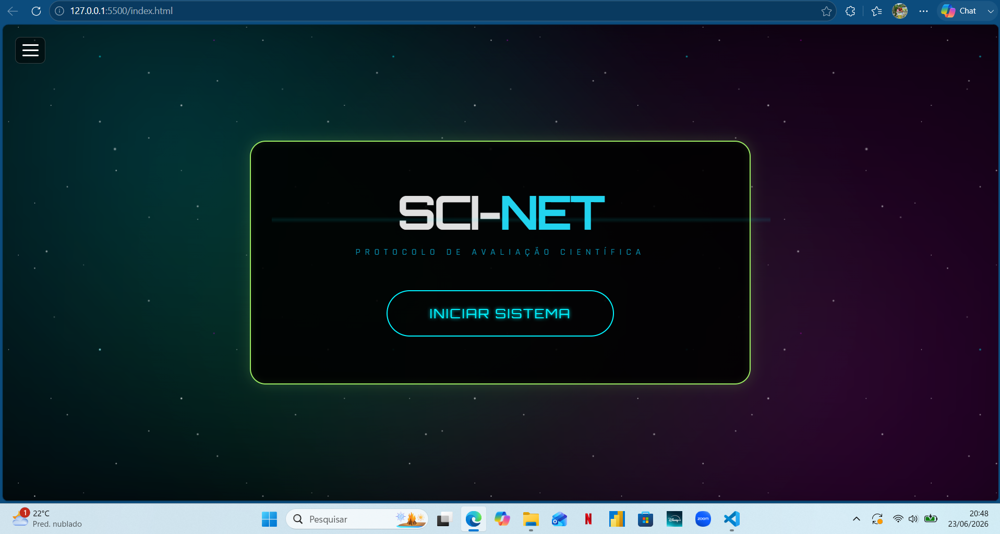

# 🌌 SCI-NET: Protocolo de Avaliação Científica

## 🚀 Sobre o Projeto
O *SCI-NET* é um terminal interativo de perguntas e respostas com temática cyberpunk e espacial. Desenvolvido para testar conhecimentos em Ciências Gerais, Astronomia e Lógica de Programação, o sistema desafia o usuário a provar seu intelecto avançando por 20 níveis de complexidade crescente.

🔗 *[Jogue o SCI-NET aqui!](COLOQUE-SEU-LINK-DO-GITHUB-PAGES-AQUI)*

## 🎮 Mecânicas Principais
* *Sistema de Vidas:* O jogador inicia com 3 vidas. Errar uma questão principal resulta em falha crítica e perda de uma vida.
* *Oportunidade de Recuperação (Questão Extra):* Ao perder vidas durante uma fase, uma 6ª questão bônus é acionada ao final do nível. O jogador tem um tempo cronometrado de 10 segundos para responder. Acertar recupera a integridade do sistema (1 vida), errar não penaliza.
* *Banco de Dados Dinâmico:* As perguntas são embaralhadas a cada nova sessão, garantindo que a experiência nunca seja a mesma.
* *Imersão Audiovisual:* Efeitos sonoros gerados via Web Audio API (sem dependência de arquivos externos), música ambiente em formato .ogg, e um fundo estelar dinâmico com nebulosas e estrelas cintilantes criados puramente com CSS.

## 🛠️ Tecnologias Utilizadas
* *HTML5:* Estruturação semântica do terminal.
* *CSS3:* Animações complexas, gradientes dinâmicos (RGB neon pulsante), filtros de desfoque para geração procedural de poeira cósmica e layout responsivo.
* *JavaScript (Vanilla):* Lógica do jogo, manipulação do DOM, controle de estado, cronômetros e sintetização de áudio (Oscillators).
* *Tailwind CSS (via CDN):* Utilizado para estilização utilitária rápida e estrutura de grid/flexbox.

## 👨‍💻 Desenvolvedor
*Israel Tech*
Focado na criação de ferramentas interativas de aprendizado e entretenimento, unindo a paixão pelo espaço sideral, tecnologia da informação e lógica de programação avançada.

* *Email:* rodriguesisrael.30@proton.me
* *GitHub:* [github.com/Rael-developer](https://github.com/Rael-developer)
* *LinkedIn:* [in/israeltech](https://www.linkedin.com/in/israel-rodrigues-a90aa2368/)